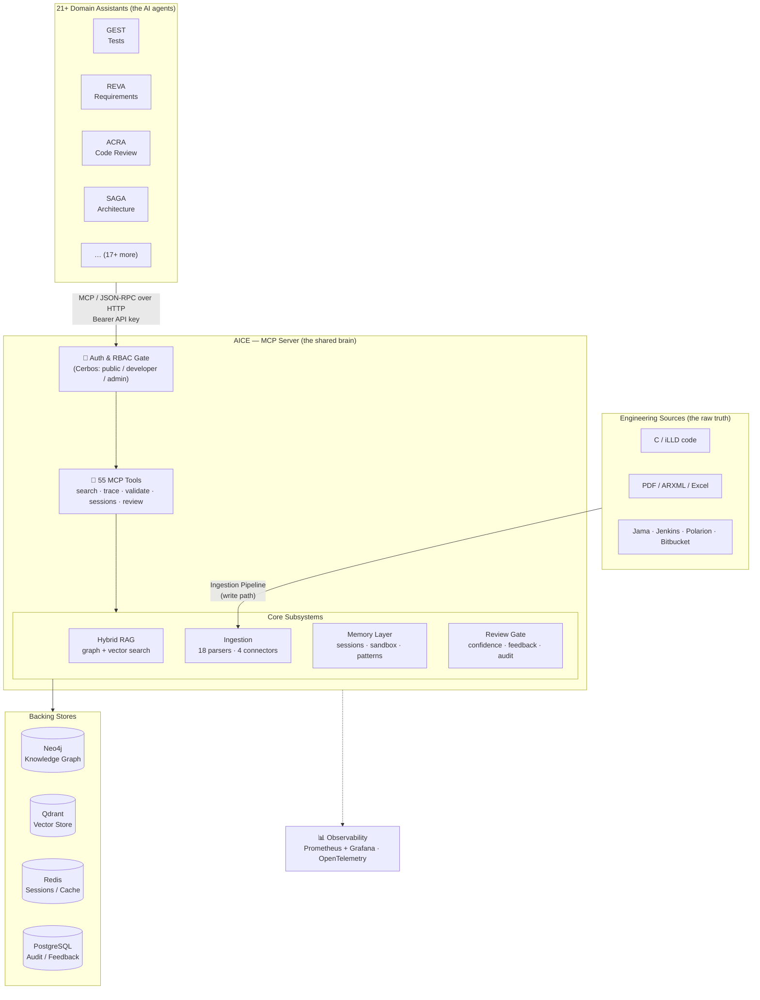
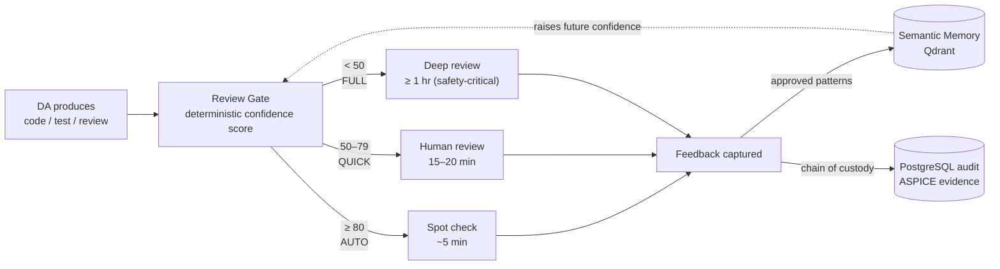

# AI Core Engine (AICE) — The Big Picture

> A one-page conceptual explanation of what AICE is, why it exists, and how the pieces fit together.
> For the implemented technical detail see [OVERVIEW.md](OVERVIEW.md). For tool-level APIs see [../DOCUMENTATION.md](../DOCUMENTATION.md).

---

## 1. The Idea in One Sentence

**AICE is the shared "brain" that gives every AI Domain Assistant trustworthy, traceable knowledge about Infineon AURIX embedded software — so the assistants generate code, tests, and reviews grounded in real engineering facts instead of guesses.**

It is **not** an LLM. It is the **knowledge and retrieval layer** that feeds high-quality, verified context *into* the LLMs that run inside each assistant.

---

## 2. The Problem It Solves

Automotive embedded software (AUTOSAR MCAL + Infineon iLLD, ISO 26262, ASPICE, MISRA) is built on a **V-Model**: every artifact must trace to another — requirements → architecture → code → tests → verification results.

When you point a generic LLM at this domain, three things go wrong:

| Problem | Consequence |
|---------|-------------|
| **No grounding** — the model invents APIs, registers, and call sequences | Unsafe, non-compilable, non-compliant output |
| **No traceability** — the model can't link a line of code back to a requirement | Fails ASPICE / ISO 26262 audits |
| **No memory or governance** — every answer is unverified and unaudited | No chain of custody for safety-critical work |

AICE fixes all three by turning scattered engineering artifacts into a **queryable knowledge graph**, exposing it through **verified, permissioned tools**, and wrapping every AI output in a **confidence + review + audit loop**.

---

## 3. The Big Picture Diagram



---

## 4. The Two Fundamental Flows

Everything AICE does reduces to **two directions of data movement**.

### 4.1 Write Path — "Learn the domain" (Ingestion)

Raw engineering artifacts are parsed into structured knowledge and stored so they can be searched later.

```
C code · PDFs · ARXML · Excel · Jama · Jenkins
        │
        ▼  18 specialized parsers + 4 enterprise connectors
   Extract nodes + relationships (functions, registers, requirements, traces)
        │
        ├──► Neo4j     — the structured knowledge graph (who calls what, what traces to what)
        ├──► Qdrant    — 384-dim embeddings for semantic "find things like this" search
        └──► PostgreSQL — job tracking + audit
```

Key idea: a `\trace{REQ-123}` comment in C code becomes a **real edge** in the graph linking that function to its requirement. Traceability stops being a spreadsheet and becomes a query.

### 4.2 Read Path — "Answer with grounded facts" (Hybrid RAG)

An assistant asks a question; AICE searches **both** the graph and the vectors, merges them, and returns verified context.

```
DA asks: "How do I initialize the CAN controller for REQ-123?"
        │
        ▼  Auth check (Cerbos) → 3-tier cache → miss → search
   ┌─────────────────────────────────────────────┐
   │ Graph search (Neo4j)   +   Vector search (Qdrant) │
   │        └──────────► RRF merge ◄──────────┘         │  ← alpha blends structure vs. meaning
   └─────────────────────────────────────────────┘
        │  (optional: rerank → compress → relevance-judge)
        ▼
   Grounded context (real API signatures, call order, trace links)
        │
        ▼
   DA's LLM generates the answer using facts, not guesses
```

Key idea — **Hybrid RAG**: the *graph* answers "what is exactly connected to what" (precise, structural); *vectors* answer "what is conceptually similar" (fuzzy, semantic). **Reciprocal Rank Fusion** blends both so you get precision *and* recall.

---

## 5. The Four Core Subsystems

| Subsystem | Question it answers | What makes it special |
|-----------|--------------------|-----------------------|
| **Hybrid RAG** (`src/HybridRAG/`) | *"What does the codebase actually say?"* | Graph + vector search fused with RRF; RLM orchestrator decomposes complex questions into ≤6 sub-queries; token-budget context assembly |
| **Ingestion Pipeline** (`src/IngestionPipeline/`) | *"How does raw engineering data become knowledge?"* | 18 parsers (libclang for C, LLM-assisted PDF, ARXML, Excel…) + connectors to Jama/Jenkins/Polarion/Bitbucket; incremental Git-aware updates |
| **Memory Layer** (`src/MemoryLayer/`) | *"How do assistants stay context-aware and safe to experiment?"* | Per-session working memory (Redis), ephemeral sandbox KG for user uploads, and persistent semantic memory of approved patterns |
| **Review Gate** (`src/ReviewGate/`) | *"Can we trust this AI output?"* | **Deterministic** (not LLM) confidence scoring → routes to AUTO / QUICK / FULL human review → feedback trains the pattern memory |

These four sit behind a single **spine**: every request enters through the MCP tool layer, passes an **authorization gate** (Cerbos RBAC), is served by a subsystem, and is **audited** to PostgreSQL with Prometheus metrics emitted.

---

## 6. What Makes AICE Trustworthy (the governance loop)

This is the part generic RAG systems skip — and it's why AICE fits a safety-critical domain.



- **Confidence is deterministic**, built from real signals (`api_verified`, `call_order_valid`, `is_safety_critical`, …) — not a model's opinion of itself.
- **Every output is archived** with its prompt, review verdict, and edits → an ASPICE-grade chain of custody.
- **Approved answers feed back** into semantic memory, so the system measurably improves over time.

---

## 7. Technology at a Glance

| Concern | Choice |
|---------|--------|
| Interface protocol | **MCP** (Model Context Protocol) over HTTP, JSON-RPC 2.0 |
| App server | **FastMCP** (FastAPI + Uvicorn), Python 3.12 |
| Knowledge graph | **Neo4j** 5.x |
| Vector store | **Qdrant** (384-dim, `all-MiniLM-L6-v2`, CPU-only) |
| Sessions & cache | **Redis** 7 (+ in-process FAISS L1 semantic cache) |
| Audit & feedback | **PostgreSQL** 16 (7-table ASPICE schema) |
| Authorization | **Cerbos** PDP — 3-tier RBAC (public / developer / admin) |
| Code parsing | **libclang** (C/C++ AST) |
| Observability | **Prometheus + Grafana**, OpenTelemetry tracing |
| Deployment | **Kubernetes / OpenShift** — multi-pod, HPA autoscaling (1→5) |

---

## 8. Mental Model to Remember

Think of AICE as a **librarian for a safety-critical engineering organization**:

1. **It reads everything** (Ingestion) — code, datasheets, requirements, CI results — and files it in a cross-referenced catalog (the knowledge graph).
2. **It answers questions precisely** (Hybrid RAG) — combining the exact card catalog (graph) with "books like this one" recommendations (vectors).
3. **It remembers your project** (Memory Layer) — your session, your uploaded drafts, and every pattern it has learned to be good.
4. **It never lets an unverified answer out the door** (Review Gate) — it scores confidence, routes risky work to humans, and keeps an audit trail for the auditors.

The 21+ Domain Assistants are the specialists who ask the librarian; **AICE is the one source of grounded truth they all share.**

---

## 9. Related Documents

- [OVERVIEW.md](OVERVIEW.md) — implemented architecture, component map, service layer
- [hybrid-rag.md](hybrid-rag.md) — search pipeline internals
- [ingestion-pipeline.md](ingestion-pipeline.md) — parsers and connectors
- [memory-layer.md](memory-layer.md) — sessions, sandbox, semantic memory
- [review-gate.md](review-gate.md) — confidence scoring and feedback loop
- [rlm-orchestrator.md](rlm-orchestrator.md) — multi-step retrieval
- [auth-and-security.md](auth-and-security.md) — RBAC and Cerbos
- [observability.md](observability.md) — metrics, audit, tracing
- [deployment.md](deployment.md) — Kubernetes / OpenShift topology
