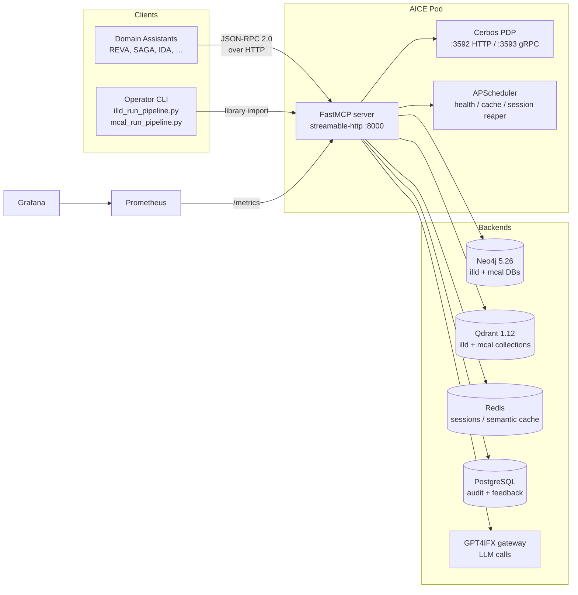
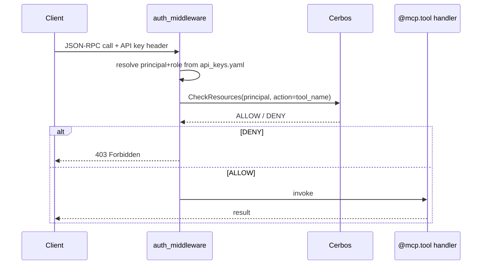
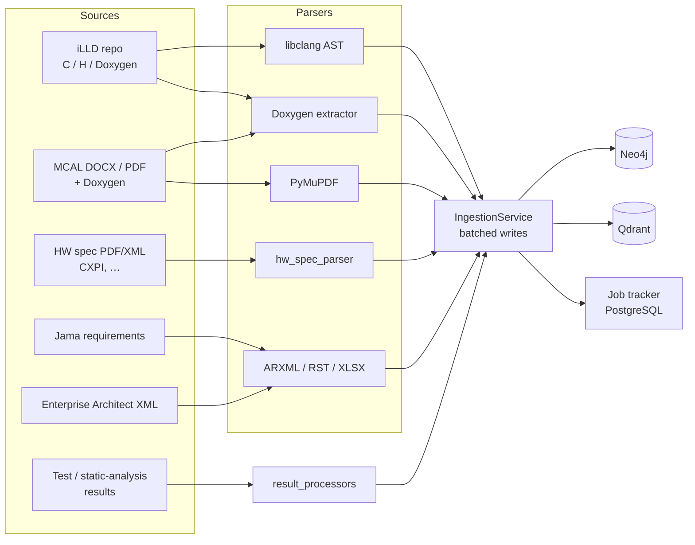
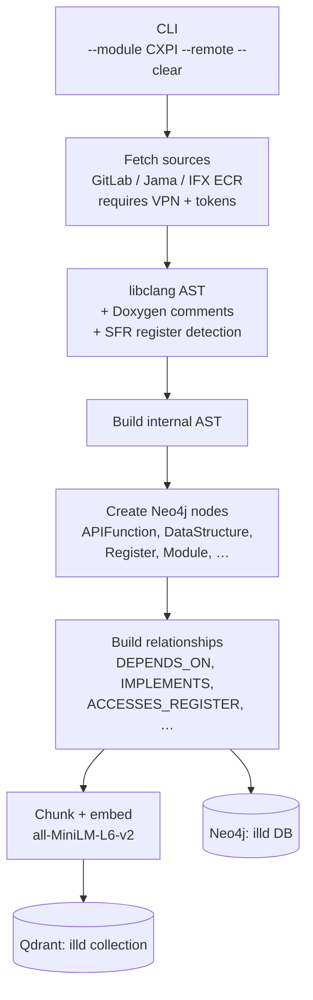
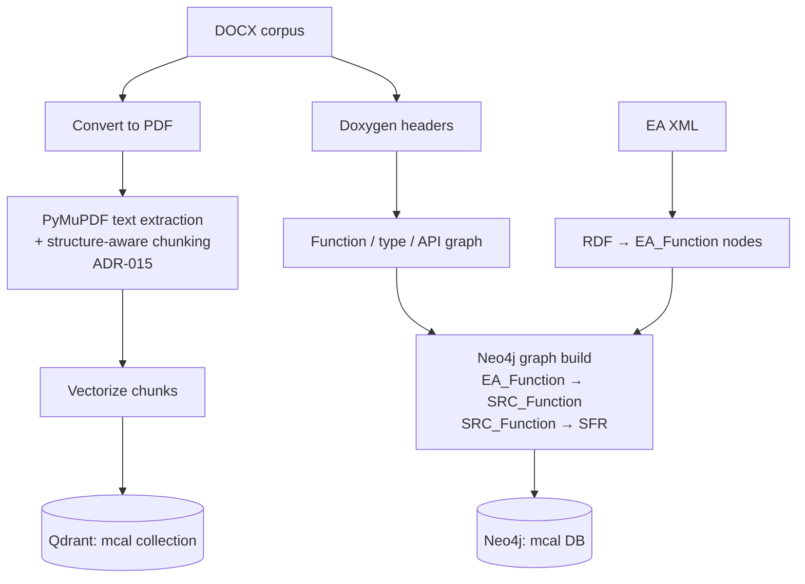
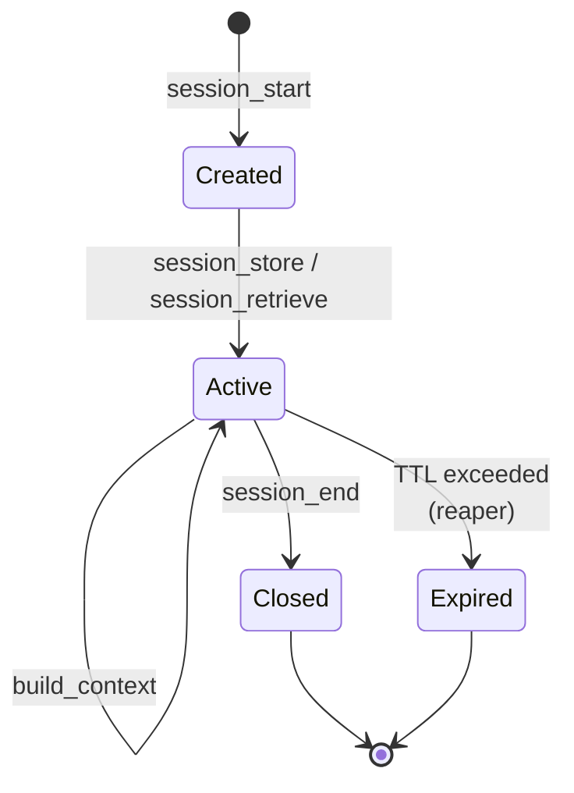
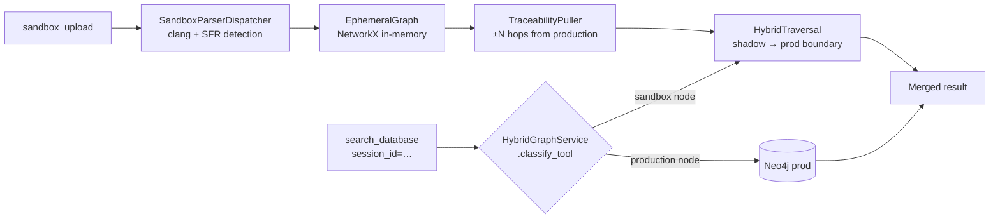
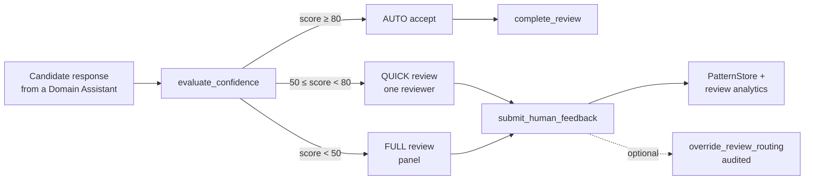
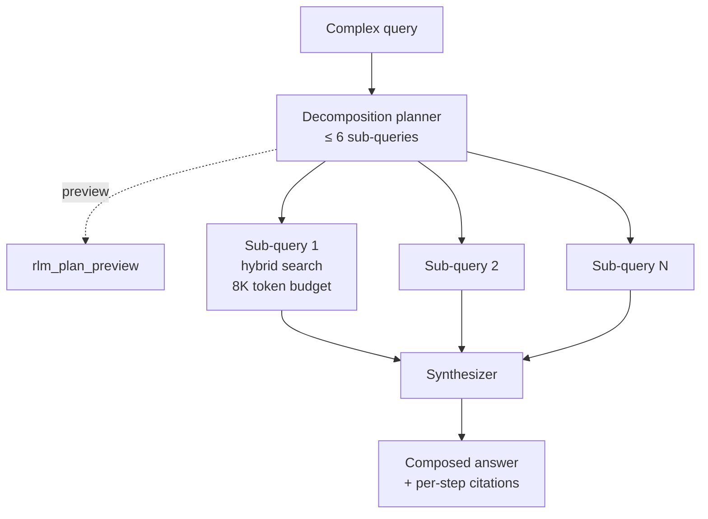
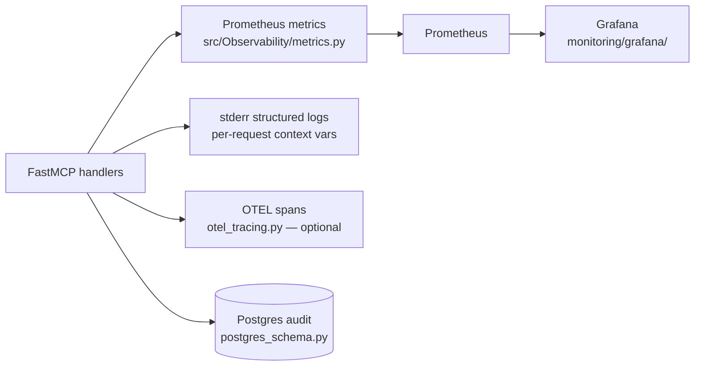

# AI Core Engine (AICE) — Technical Documentation

> **Scope.** This document describes the AICE system as implemented in this
> repository. It is generated from the actual code (entry points, tool
> registrations, ingestion pipelines, configuration files) and aims to stay in
> sync with what runs. Governance / AI-governance artifacts are intentionally
> excluded — see [`docs/ai_governance_files/`](ai_governance_files/) for those.
>
> A previous version of this file is preserved at
> [`docs/DOCUMENTATION.previous.md`](DOCUMENTATION.previous.md).

---

## Table of Contents

- [AI Core Engine (AICE) — Technical Documentation](#ai-core-engine-aice--technical-documentation)
  - [Table of Contents](#table-of-contents)
  - [1. What AICE is](#1-what-aice-is)
  - [2. Repository layout](#2-repository-layout)
  - [3. Runtime topology](#3-runtime-topology)
  - [4. MCP server](#4-mcp-server)
    - [4.1 Entry point](#41-entry-point)
    - [4.2 Tool registration](#42-tool-registration)
    - [4.3 Server-side cross-cutting](#43-server-side-cross-cutting)
  - [5. MCP tool reference](#5-mcp-tool-reference)
    - [Cat 1 — Search \& query (6)](#cat-1--search--query-6)
    - [Cat 2 — API intelligence (3)](#cat-2--api-intelligence-3)
    - [Cat 3 — Dependency analysis (3)](#cat-3--dependency-analysis-3)
    - [Cat 4 — Traceability (4)](#cat-4--traceability-4)
    - [Cat 5 — Ingestion](#cat-5--ingestion)
    - [Cat 6 — Memory \& context (5)](#cat-6--memory--context-5)
    - [Cat 6+ — Ephemeral sandbox (4)](#cat-6--ephemeral-sandbox-4)
    - [Cat 6+ — RLM (2)](#cat-6--rlm-2)
    - [Cat 6+ — HSI (1)](#cat-6--hsi-1)
    - [Cat 7 — Cache (5)](#cat-7--cache-5)
    - [Cat 8 — Feedback \& learning (4)](#cat-8--feedback--learning-4)
    - [Cat 9 — Review gate (4)](#cat-9--review-gate-4)
    - [Cat 10 — Ontology \& config (4)](#cat-10--ontology--config-4)
    - [Cat 11 — Observability \& health (6)](#cat-11--observability--health-6)
    - [Cat 12 — Visualization (1)](#cat-12--visualization-1)
    - [Cat 13 — Authentication (2)](#cat-13--authentication-2)
    - [Cat 14 — GAP v2 (1)](#cat-14--gap-v2-1)
  - [6. Authentication \& authorization](#6-authentication--authorization)
  - [7. Hybrid RAG — search and retrieval](#7-hybrid-rag--search-and-retrieval)
    - [7.1 Flow](#71-flow)
    - [7.2 Components](#72-components)
    - [7.3 RRF formula](#73-rrf-formula)
    - [7.4 Query enhancement](#74-query-enhancement)
  - [8. Ingestion pipelines](#8-ingestion-pipelines)
    - [8.1 ILLD pipeline](#81-illd-pipeline)
    - [8.2 MCAL pipeline](#82-mcal-pipeline)
    - [8.3 HW spec / CXPI parser](#83-hw-spec--cxpi-parser)
    - [8.4 Other ingestion paths](#84-other-ingestion-paths)
  - [9. Memory layer](#9-memory-layer)
    - [9.1 Working memory (sessions)](#91-working-memory-sessions)
    - [9.2 Ephemeral sandbox](#92-ephemeral-sandbox)
    - [9.3 Semantic memory (learning loop)](#93-semantic-memory-learning-loop)
  - [10. Review Gate](#10-review-gate)
  - [11. Cache service](#11-cache-service)
  - [12. RLM orchestrator](#12-rlm-orchestrator)
  - [13. Observability](#13-observability)
  - [14. Configuration \& environment variables](#14-configuration--environment-variables)
  - [15. Storage backends](#15-storage-backends)
  - [16. Deployment](#16-deployment)
    - [16.1 Container](#161-container)
    - [16.2 Compose / pod topology](#162-compose--pod-topology)
    - [16.3 Reverse proxy](#163-reverse-proxy)
    - [16.4 Kubernetes](#164-kubernetes)
  - [17. Testing](#17-testing)
  - [18. Architecture decisions (ADR index)](#18-architecture-decisions-adr-index)
  - [19. Not implemented / deferred](#19-not-implemented--deferred)
    - [Code-level stubs](#code-level-stubs)
    - [Deferred ADRs](#deferred-adrs)
    - [Removed from MCP surface](#removed-from-mcp-surface)
  - [20. Glossary](#20-glossary)

---

## 1. What AICE is

The **AI Core Engine** is an on-premise Model Context Protocol (MCP) server that
exposes a single, governed knowledge surface over Infineon AURIX™ TC3xx
embedded software artifacts:

- AUTOSAR Classic **MCAL** drivers,
- Infineon **iLLD** reference software,
- **Hardware specifications** (registers, bitfields, interrupts, trust zones),
- **Requirements** pulled from Jama,
- **Architecture** pulled from Enterprise Architect,
- **Test / static-analysis results** (VectorCAST, Polyspace, JUnit, coverage,
  compiler diagnostics).

These artifacts are normalized into a **Neo4j knowledge graph** and a **Qdrant
vector index**, then served through 55 typed MCP tools to a fleet of *Domain
Assistants* (DAs) — specialized LLM agents that consume AICE rather than
talking to raw repositories.

Design goals:

- **Deterministic, auditable answers** — every tool result is traceable to a
  graph node or chunk; confidence scoring is rule-based, not LLM-judged.
- **Hybrid retrieval** — graph traversal + vector similarity merged with
  Reciprocal Rank Fusion.
- **Tenant safety** — Cerbos-enforced RBAC, ephemeral sandboxes for
  uncommitted documents, multi-profile (illd / mcal) isolation.
- **On-premise only** — no cloud LLM dependency for the engine itself; LLM
  calls are routed via the internal GPT4IFX gateway.

---

## 2. Repository layout

```
ai-core-engine/
├── mcp/                    MCP server (entrypoint + tools + auth)
│   ├── app.py              Pod entrypoint (starts Cerbos + FastMCP)
│   ├── core/
│   │   ├── mcp_server.py   All @mcp.tool() registrations (~4500 LOC)
│   │   ├── tool_tiers.py   public / developer / admin tier map
│   │   ├── auth_middleware.py
│   │   ├── rate_limiter.py
│   │   ├── streaming.py
│   │   ├── swagger_ui.py
│   │   └── config.py
│   └── auth/               Cerbos policies + API-key registry
│
├── src/
│   ├── Configuration/      CacheService, OntologyService, embeddings
│   ├── HybridRAG/          Search, KG build, RAG ingestion, RLM
│   │   ├── code/
│   │   │   ├── querier/    SearchService, KI, RLMOrchestrator
│   │   │   ├── KG/         build_knowledge_graph.py
│   │   │   ├── RAG/        Qdrant ingestion
│   │   │   ├── lib/        neo4j_manager, token_manager, env_config
│   │   │   ├── illd_run_pipeline.py
│   │   │   ├── mcal_run_pipeline.py
│   │   │   ├── run_hw_um_pipeline.py
│   │   │   └── run_rc1_pipeline.py
│   │   └── config/storage_config.yaml
│   ├── IngestionPipeline/  Parsers (clang, PDF, hw-spec, ARXML…) + Connectors
│   ├── MemoryLayer/        Working memory, ephemeral sandbox, semantic memory
│   ├── Observability/      Prometheus metrics, OTEL tracing, Postgres schema
│   └── ReviewGate/         Confidence scoring, feedback sink, result processors
│
├── tests/                  unit/, integration/, e2e/, load/, manual/
├── docs/                   Architecture, ADRs, this document
├── requirements/           Subsystem specifications (markdown)
├── scripts/                dry_run_srs, smoke_test_hw_spec_parser, …
├── monitoring/             prometheus.yml + Grafana dashboards
├── nginx/                  Reverse-proxy config
├── Dockerfile              2-stage build: Cerbos + Python MCP server
└── requirements.txt
```

---

## 3. Runtime topology



Single-process pod, multi-worker capable (`WEB_CONCURRENCY`, gunicorn + uvicorn
workers). Cerbos runs as a sibling subprocess inside the same pod so RBAC
decisions stay local.

---

## 4. MCP server

### 4.1 Entry point

[`mcp/app.py`](../mcp/app.py) is the container `CMD`. Its `main()`:

1. Launches Cerbos PDP (`cerbos server --config=auth/.cerbos.yaml`) as a
   subprocess.
2. Polls `/​_cerbos/health` (timeout 30 s); aborts if unhealthy.
3. Installs signal handlers (`SIGTERM`, `SIGINT`, `SIGCHLD`) for graceful
   shutdown and child-death detection.
4. Starts `APScheduler` background jobs:
   - periodic backend health check,
   - cache-stats snapshot,
   - session reaper (TTL expiry),
   - GPT4IFX token refresh.
5. Boots the FastMCP server over **streamable-http** transport (MCP 2.0,
   JSON-RPC 2.0).

### 4.2 Tool registration

All tools live in [`mcp/core/mcp_server.py`](../mcp/core/mcp_server.py) under
`@mcp.tool()` decorators (one per tool, ~60 decorated functions, 4 commented-out
deprecated ingestion tools and 1 deprecated `sandbox_query`).

At startup, [`mcp/core/tool_tiers.py`](../mcp/core/tool_tiers.py)
`validate_tool_registration()` runs a **fail-fast** check:

- every `@mcp.tool()` must have an entry in `TOOL_TIERS`,
- every tool parameter must be type-annotated,
- every tool must declare a return type.

Set `STRICT_SIGNATURE_VALIDATION=true` to upgrade signature issues from
warnings to startup errors.

### 4.3 Server-side cross-cutting

- **Auth middleware** ([`auth_middleware.py`](../mcp/core/auth_middleware.py))
  — extracts API key, principal, role; calls Cerbos for each tool invocation.
- **Rate limiter** ([`rate_limiter.py`](../mcp/core/rate_limiter.py)) — slowapi
  (ADR-040), per-principal token bucket.
- **Streaming** ([`streaming.py`](../mcp/core/streaming.py)) — chunked responses
  for long-running tools (visualize, RLM).
- **Swagger UI** ([`swagger_ui.py`](../mcp/core/swagger_ui.py)) — OpenAPI 3
  surface for human exploration.
- **Singleton service factories** (ADR-013) — `_get_neo4j()`, `_get_qdrant()`,
  `_get_redis()` cached per profile (illd / mcal).

---

## 5. MCP tool reference

**55 tools across 14 categories.** Tier column: `P` = public, `D` = developer,
`A` = admin (hierarchy: admin ⊃ developer ⊃ public). Tier source of truth:
[`mcp/core/tool_tiers.py`](../mcp/core/tool_tiers.py).

### Cat 1 — Search & query (6)

| Tool | Tier | Purpose |
|---|---|---|
| `search_database` | P | Hybrid graph + vector search with RRF merge. Supports `session_id` for sandbox overlay (replaces deprecated `sandbox_query`). |
| `search_nodes` | P | Deterministic label/keyword/property-filter graph queries. |
| `get_node_by_id` | P | Exact lookup by `document_id` or `jama_id`. |
| `get_neighbors` | D | Graph traversal (in / out / both, multi-hop). |
| `shortest_path` | D | Cypher shortest-path between two node IDs. |
| `execute_cypher` | D | Read-only Cypher. Write clauses (`CREATE/MERGE/DELETE/SET/REMOVE`) rejected. |

### Cat 2 — API intelligence (3)

| Tool | Tier | Purpose |
|---|---|---|
| `query_api_function` | P | Returns 25+ enriched fields for an API function: signature, parameters, return type, owning module, requirements, tests, dependencies, HSI accesses. |
| `get_type_definition` | P | Struct / enum / typedef with member fields, sizes, alignment. |
| `generate_initialization_code` | P | C struct initializer code, merging KG-derived defaults with user overrides. |

### Cat 3 — Dependency analysis (3)

| Tool | Tier | Purpose |
|---|---|---|
| `query_dependencies` | P | Direct + transitive dependency tree, with topological init sequence. |
| `validate_api_usage` | P | Checks a function call sequence against the dependency graph. |
| `detect_polling_requirements` | P | Flags functions that need status polling after invocation. |

### Cat 4 — Traceability (4)

| Tool | Tier | Purpose |
|---|---|---|
| `find_requirement_traces` | P | Full V-model chain: Requirement → Architecture → Code → Test → Result. |
| `build_traceability_matrix` | P | Module-wide coverage matrix (requirements × links). |
| `find_coverage_gaps` | P | Missing chain links per requirement. |
| `analyze_hw_sw_links` | P | Hardware register → software function map; flags undocumented accesses. |

### Cat 5 — Ingestion

> **Removed from MCP in Plan 2 Phase 2.** All file ingestion now flows through
> `sandbox_upload` (Cat 6+). The underlying library code in
> [`src/IngestionPipeline/`](../src/IngestionPipeline/) and the
> `*_run_pipeline.py` scripts remain for batch / operator use.

### Cat 6 — Memory & context (5)

| Tool | Tier | Purpose |
|---|---|---|
| `session_start` | P | Create a working-memory session (`assistant_name`, `module_context`, `workspace_id`, TTL). |
| `session_store` | P | Put a key/value into the session. |
| `session_retrieve` | P | Get a value from the session. |
| `build_context` | P | Token-budget-aware assembly across up to 10 slots (default 8 K tokens). |
| `session_end` | P | Close session + persist audit row. |

### Cat 6+ — Ephemeral sandbox (4)

| Tool | Tier | Purpose |
|---|---|---|
| `sandbox_upload` | P | Upload files into a per-session ephemeral KG + vector overlay. Triggers rich C parsing (clang + SFR detection) and ±N traceability pull from production. |
| `sandbox_status` | P | Inspect sandbox contents (node counts, parser stats, TTL). |
| `sandbox_clear` | P | Destroy a sandbox before TTL expiry. |
| `sandbox_diff` | P | Compare sandbox vs production: added / modified / unchanged nodes. |

### Cat 6+ — RLM (2)

| Tool | Tier | Purpose |
|---|---|---|
| `rlm_orchestrate` | D | Decompose a complex query into ≤ 6 sub-queries, execute via hybrid search, synthesize. |
| `rlm_plan_preview` | P | Show the decomposition plan without executing. |

### Cat 6+ — HSI (1)

| Tool | Tier | Purpose |
|---|---|---|
| `get_function_hsi` | P | Structured Hardware-Software Interface: SFR registers, global variables, access types (R/W/RW), trust zones. |

### Cat 7 — Cache (5)

| Tool | Tier | Purpose |
|---|---|---|
| `cache_get` | D | Inspect a cache entry across LRU / semantic / RAG tiers. |
| `cache_stats` | D | Per-tier hit rate, size, evictions. |
| `cache_invalidate_module` | A | Clear all entries scoped to a module. |
| `cache_clear` | A | Clear all or selected tiers. |
| `cache_refresh_config` | A | Reload cache parameters from env without restart. |

### Cat 8 — Feedback & learning (4)

| Tool | Tier | Purpose |
|---|---|---|
| `submit_human_feedback` | P | Record reviewer decision: `APPROVE` / `REJECT` / `APPROVE_WITH_EDITS` / `ESCALATE`. |
| `get_learning_metrics` | D | Improvement trends, pattern counts. |
| `get_failure_patterns` | D | Query learned failure patterns by module / category. |
| `process_results` | A | Ingest test / analysis results (VectorCAST, Polyspace, JUnit, coverage, compiler). |

### Cat 9 — Review gate (4)

| Tool | Tier | Purpose |
|---|---|---|
| `evaluate_confidence` | P | Deterministic scoring → routing (`AUTO` / `QUICK` / `FULL`). |
| `complete_review` | P | Mark a review completed. |
| `override_review_routing` | D | Escalate / downgrade review level (audited). |
| `get_review_analytics` | D | Routing stats, approval rates, override frequency. |

### Cat 10 — Ontology & config (4)

| Tool | Tier | Purpose |
|---|---|---|
| `list_ontology_profiles` | P | Available profiles (`illd`, `mcal`). |
| `get_ontology_schema` | P | Node labels, relationship types, properties (optionally with live counts). |
| `validate_entity` | D | Validate an entity dict against ontology rules. |
| `get_ontology_compliance` | D | Module compliance score + issue list. |

### Cat 11 — Observability & health (6)

| Tool | Tier | Purpose |
|---|---|---|
| `health_check` | P | Neo4j / Qdrant / Redis / GPT4IFX status. |
| `get_graph_statistics` | P | Node + relationship counts by type. |
| `list_available_modules` | P | ILLD via Qdrant collections, MCAL via Neo4j. |
| `get_distribution` | P | Parametric distribution (status, ASIL, domain). |
| `get_coverage_report` | P | Aggregate traceability coverage %. |
| `detect_communities` | D | GDS community detection (optional persistence). |

### Cat 12 — Visualization (1)

| Tool | Tier | Purpose |
|---|---|---|
| `visualize_subgraph` | D | Interactive pyvis HTML from seed nodes / filters. |

### Cat 13 — Authentication (2)

| Tool | Tier | Purpose |
|---|---|---|
| `get_token_info` | D | Decode the active GPT4IFX JWT (`iat`, `exp`, remaining lifetime). |
| `ensure_valid_token` | A | Force token refresh / validation. |

### Cat 14 — GAP v2 (1)

| Tool | Tier | Purpose |
|---|---|---|
| `query_enhance` | D | Run the query-enhancement pipeline (rule-based for ILLD, LLM-driven for MCAL) standalone. |

> **Deprecated / removed.** Source comments mark these explicitly:
> - `ingest_file`, `ingest_module_from_repo`, `batch_ingest_modules`,
>   `ingest_repository` — removed in Plan 2 Phase 2.
> - `sandbox_query` — replaced by `search_database(session_id=...)` in Plan 2
>   Phase 6.

---

## 6. Authentication & authorization



- **API key registry**: [`mcp/auth/api_keys.yaml`](../mcp/auth/api_keys.yaml).
- **Policies**: [`mcp/auth/policies/`](../mcp/auth/) — Cerbos policy YAMLs;
  resources mirror tool categories, actions are tool names.
- **Tier hierarchy** (see `TIER_HIERARCHY` in
  [`tool_tiers.py`](../mcp/core/tool_tiers.py)):
  - `public` → may call `public` tools,
  - `developer` → public + developer,
  - `admin` → all.

LLM gateway credentials are handled separately by `token_manager.py`
(GPT4IFX) and refreshed via the `ensure_valid_token` admin tool / APScheduler
job.

---

## 7. Hybrid RAG — search and retrieval

### 7.1 Flow

```mermaid
flowchart TD
    Q[Query] --> ENH{Query<br/>enhancer}
    ENH -->|ILLD: rule-based| ENH_OUT[Enhanced query +<br/>synonyms + filters]
    ENH -->|MCAL: LLM CoT| ENH_OUT
    ENH_OUT --> G[Graph path<br/>Cypher on Neo4j]
    ENH_OUT --> V[Vector path<br/>Qdrant cosine<br/>all-MiniLM-L6-v2 384d]
    G --> RRF{Reciprocal<br/>Rank Fusion<br/>k=60, α∈[0,1]}
    V --> RRF
    RRF --> RR[Optional rerank<br/>FlashRank ONNX]
    RR --> CACHE[(LRU + semantic cache)]
    CACHE --> RESP[Result + citations]
```

### 7.2 Components

| Concern | Implementation | File |
|---|---|---|
| Hybrid orchestration | `SearchService` | [`src/HybridRAG/code/querier/`](../src/HybridRAG/code/querier/) |
| API knowledge | `KnowledgeIntelligenceService` | same dir |
| RLM (multi-step) | `RLMOrchestrator` | same dir |
| Graph build | `build_knowledge_graph.py` (~4 700 LOC) | [`src/HybridRAG/code/KG/`](../src/HybridRAG/code/KG/) |
| Vector ingestion | RAG package | [`src/HybridRAG/code/RAG/`](../src/HybridRAG/code/RAG/) |
| Sandbox overlay | `HybridGraphService` + `HybridTraversal` | [`src/MemoryLayer/memory/ephemeral_sandbox.py`](../src/MemoryLayer/memory/ephemeral_sandbox.py) |

### 7.3 RRF formula

For each result appearing in either ranked list:

$$
\mathrm{score}(d) \;=\; \frac{\alpha}{k + \mathrm{rank}_{\text{graph}}(d)} \;+\; \frac{1-\alpha}{k + \mathrm{rank}_{\text{vector}}(d)}
$$

with `k = 60` (default) and `α ∈ [0, 1]` (default tuned per profile;
α → 1 favors graph hits, α → 0 favors vector hits). See ADR-003.

### 7.4 Query enhancement

- **ILLD**: rule-based — domain synonyms (e.g. *channel* ↔ *ch*), module
  prefix expansion, complexity classification.
- **MCAL**: LLM-driven (`McalQueryEnhancer`) — GraphProbe samples node labels,
  Chain-of-Thought expansion, Cypher-pattern detection for targeted traversal.

Both are exposed via the `query_enhance` MCP tool.

---

## 8. Ingestion pipelines



The shared services:

- `IngestionService` ([`src/IngestionPipeline/ingestion_service.py`](../src/IngestionPipeline/ingestion_service.py))
  — orchestrates parsers, batches writes via `Neo4jBatchWriter`, records
  progress in `IngestionJobTracker`.
- Connectors ([`src/IngestionPipeline/Connectors/`](../src/IngestionPipeline/))
  — Jama, Enterprise Architect, GitLab, Bitbucket.

### 8.1 ILLD pipeline

Entry: [`src/HybridRAG/code/illd_run_pipeline.py`](../src/HybridRAG/code/illd_run_pipeline.py)
(class `ILLDPipeline`). Modules currently wired: **CXPI, LIN, FLEXRAY, I2C,
SPI, CAN**.



Useful flags:
- `--remote` pull fresh sources, `--local` use a checked-out tree,
- `--clear` wipe target DB / collection,
- `--skip-rag` skip Qdrant ingestion (graph-only smoke run).

### 8.2 MCAL pipeline

Entry: [`src/HybridRAG/code/mcal_run_pipeline.py`](../src/HybridRAG/code/mcal_run_pipeline.py).
Targets AUTOSAR Classic MCAL modules (ADC, CAN, DIO, ETH, FLS, GPT, ICU, MCU,
PWM, SPI, WDG, …).



### 8.3 HW spec / CXPI parser

[`src/IngestionPipeline/Parsers/hw_spec_parser.py`](../src/IngestionPipeline/Parsers/hw_spec_parser.py)

- Parses register definitions, bitfields, interrupt metadata, trust zones.
- Resolves channel-placeholder expansion (`CHx` → `CH0..CHn`).
- Outputs `Register` and `Bitfield` nodes plus relationships.
- The smoke test ([`scripts/smoke_test_hw_spec_parser.py`](../scripts/smoke_test_hw_spec_parser.py))
  is the recommended regression for parser changes.
- Field `interrupt_masked_by_field` is currently **stubbed** — see §19.

### 8.4 Other ingestion paths

| Path | Source | Output |
|---|---|---|
| Requirements | Jama (REST) | `SoftwareRequirement` / `SystemRequirement` nodes |
| Architecture | EA XML | `EA_Function`, `EA_Component` nodes |
| Test results | VectorCAST / Polyspace / JUnit / coverage / compiler logs | `TestResult` nodes via `process_results` (admin tool) |
| Ad-hoc docs | Per-session via `sandbox_upload` | Ephemeral graph + vector overlay (TTL-scoped) |

---

## 9. Memory layer

Located at [`src/MemoryLayer/memory/`](../src/MemoryLayer/memory/). Three
distinct memories:

### 9.1 Working memory (sessions)



- `WorkingMemoryManager` exposes the five session tools (Cat 6).
- Backend strategies: `InMemoryBackend` (default) or `RedisBackend` (multi-pod).
  Selected via `REDIS_URL` env (ADR-006).
- TTL via `SESSION_TTL_SECONDS` (default `3600`).
- Per-session metadata: `assistant_name`, `module_context`, `workspace_id`.

### 9.2 Ephemeral sandbox



Use-case: a domain assistant uploads an in-progress header / driver, queries
it as if it were in the KG, then `sandbox_clear` (or TTL) destroys it. No
write ever lands in production Neo4j.

### 9.3 Semantic memory (learning loop)

- `PatternStore` (Neo4j) — approved / rejected patterns tagged by
  `task_type`, `module`.
- `PatternIndex` (Qdrant) — pattern embeddings for similarity recall.
- Populated by `submit_human_feedback`; queried by `get_failure_patterns` and
  used implicitly by the Review Gate.

---

## 10. Review Gate

Located at [`src/ReviewGate/`](../src/ReviewGate/).



Signals fed into the deterministic confidence formula:

`rag_score`, `sources_count`, `has_code`, `has_traceability`, `module`,
`task_type`, `domain`. Weights are configurable (ADR-004).

`process_results` ingests external test/static-analysis outputs and links
`TestResult` nodes back to the requirements they cover, feeding both
traceability tools and the learning loop.

---

## 11. Cache service

[`src/Configuration/cache_service.py`](../src/Configuration/cache_service.py).
Three tiers (ADR-007):

| Tier | Backend | Purpose |
|---|---|---|
| LRU (exact) | in-process dict | Memoize identical queries |
| Semantic | FAISS (in-process) | Reuse answers for paraphrased queries above `SEMANTIC_CACHE_THRESHOLD` |
| RAG (optional) | Redis | Cross-pod sharing |

Knobs: `LRU_CACHE_SIZE`, `LRU_CACHE_TTL_HOURS`, `SEMANTIC_CACHE_MAX_SIZE`,
`SEMANTIC_CACHE_THRESHOLD`. Reload at runtime with `cache_refresh_config`.
Inspect with `cache_get` / `cache_stats`; invalidate with
`cache_invalidate_module` / `cache_clear`.

---

## 12. RLM orchestrator

`RLMOrchestrator`
([`src/HybridRAG/code/querier/`](../src/HybridRAG/code/querier/)) implements
the *Recursive Language Model* pattern (ADR-009).



Surfaced as the `rlm_orchestrate` tool (developer tier) and `rlm_plan_preview`
(public, for cheap UX previewing).

---

## 13. Observability



Prometheus metric families:

| Metric | Type | Labels |
|---|---|---|
| `REQUESTS_TOTAL` | Counter | tool, workspace, status |
| `QUERY_LATENCY`, `SEARCH_DURATION` | Histogram | tool, profile |
| `CACHE_REQUESTS_TOTAL` | Counter | tier, hit |
| `BACKEND_UP` | Gauge | backend (neo4j / qdrant / redis / gpt4ifx) |
| `ACTIVE_SESSIONS` | Gauge | — |
| `REVIEW_ROUTING_TOTAL` | Counter | route (AUTO / QUICK / FULL) |

The Postgres audit schema
([`src/Observability/postgres_schema.py`](../src/Observability/postgres_schema.py))
defines seven tables: sessions, feedback, ingestion jobs, results, metrics,
plus supporting indexes — used by `get_learning_metrics`,
`get_review_analytics`, and external compliance reports.

OTEL tracing (ADR-036, revised) is wired but **opt-in** — enable via
environment variables in `otel_tracing.py`.

---

## 14. Configuration & environment variables

Loaded at process start by `mcp/app.py` and the various service singletons.

| Variable | Default | Purpose |
|---|---|---|
| `CERBOS_BIN` | `cerbos` | PDP binary path |
| `CERBOS_CONFIG` | `mcp/auth/.cerbos.yaml` | Policy bundle |
| `CERBOS_HOST` / `CERBOS_HTTP_PORT` / `CERBOS_GRPC_PORT` | `localhost` / `3592` / `3593` | PDP endpoints |
| `NEO4J_URI`, `NEO4J_USERNAME`, `NEO4J_PASSWORD` | — | Graph DB (per active profile, see storage_config.yaml) |
| `QDRANT_URL`, `QDRANT_API_KEY` | — | Vector store |
| `REDIS_URL`, `REDIS_TLS` | unset | Optional session / cache backend |
| `SESSION_TTL_SECONDS` | `3600` | Working memory TTL |
| `LRU_CACHE_SIZE`, `LRU_CACHE_TTL_HOURS` | tuned | LRU tier |
| `SEMANTIC_CACHE_MAX_SIZE`, `SEMANTIC_CACHE_THRESHOLD` | tuned | Semantic tier |
| `QUERY_ENHANCER_ENABLED` | `1` for MCAL | Enable LLM enhancer |
| `API_KEY_REGISTRY_PATH` | `mcp/auth/api_keys.yaml` | Principal/role map |
| `GPT4IFX_USERNAME`, `GPT4IFX_PASSWORD` | — | LLM gateway credentials |
| `INCLUDE_HEADERS_DIR` | `/app/include_headers` | Sandbox C parsing |
| `WEB_CONCURRENCY` | `4` | gunicorn workers |
| `STRICT_SIGNATURE_VALIDATION` | unset | Fail startup on tool signature warnings |

Profile YAML: [`src/HybridRAG/config/storage_config.yaml`](../src/HybridRAG/config/storage_config.yaml).
`active_instance` chooses **`mcal` | `illd` | `local`** and is also used to
select the ontology profile. Each instance declares both an external
(`bolt+ssc://…icp.infineon.com:443`) and an in-cluster
(`bolt://neo4j-…:7687`) URI; the right one is chosen at runtime.

Ontology: [`src/MemoryLayer/memory/ontology_loader.py`](../src/MemoryLayer/memory/ontology_loader.py)
+ `ontology.yaml` next to it. Dual-profile (illd / mcal) and optionally
multi-profile (`allow_multi_profile: true`).

---

## 15. Storage backends

| Backend | Version | Role | Notes |
|---|---|---|---|
| **Neo4j** | 5.26 Community | Knowledge graph | Per-profile DBs (`illd`, `mcal`), APOC + GDS plugins. Connection pool: 50 max, 3600 s lifetime, 60 s acquisition timeout. |
| **Qdrant** | 1.12.1 | Vector store | 384-d embeddings (`all-MiniLM-L6-v2`), cosine distance, HNSW indexing. In-cluster gRPC `:6334`, external HTTPS `:443` (gRPC disabled outside cluster — HTTPS ingress is HTTP/1.1 only). |
| **Redis** | optional | Sessions + RAG cache | TLS supported. |
| **PostgreSQL** | required | Audit + feedback + analytics | Schema in `postgres_schema.py`. |
| **GPT4IFX gateway** | internal | LLM calls (MCAL enhancer, RLM, sandbox doc parsing) | JWT-managed by `token_manager.py`. |

---

## 16. Deployment

### 16.1 Container

[`Dockerfile`](../Dockerfile) — 2-stage build:

1. **Stage 1** pulls the Cerbos binary from `ghcr.io/cerbos/cerbos`.
2. **Stage 2** = `python:3.12-slim` plus:
   - CPU-only **PyTorch 2.11.0** (from the internal Artifactory mirror),
   - pre-downloaded `sentence-transformers/all-MiniLM-L6-v2`,
   - pre-downloaded **LLMLingua** model (ADR-025),
   - Cerbos policies under `/app/auth/`,
   - C include-header stubs under `/app/include_headers/` (sandbox parsing),
   - gunicorn + uvicorn workers (`WEB_CONCURRENCY=4`).

Entry: `python /app/app.py`.

### 16.2 Compose / pod topology

Five services:

| Service | Port |
|---|---|
| AICE MCP | `8000` |
| Neo4j | `7687` (bolt), `7474` (HTTP) |
| Qdrant | `6333` (REST), `6334` (gRPC) |
| Redis | `6379` |
| PostgreSQL | `5432` |

Plus optional: **Prometheus** (scrape `/metrics`) + **Grafana**
(dashboards in [`monitoring/grafana/`](../monitoring/grafana/)).

### 16.3 Reverse proxy

[`nginx/nginx.conf`](../nginx/nginx.conf) terminates HTTPS and forwards to the
MCP pod. Used in deployments where the pod is not directly exposed.

### 16.4 Kubernetes

Manifests under [`mcp/k8s/`](../mcp/) (per-environment overlays). Cerbos
co-located in the same pod by design — RBAC stays a function call away, not a
network hop.

---

## 17. Testing

| Suite | Location | What runs there |
|---|---|---|
| Unit | [`tests/unit/`](../tests/unit/) | Service functions, cache tiers, confidence formula |
| Integration | [`tests/integration/`](../tests/integration/) | Tool handlers against live Neo4j / Qdrant, session lifecycle |
| End-to-end | [`tests/e2e/`](../tests/e2e/) | Ingest → search → feedback → learn |
| Load | [`tests/load/`](../tests/load/) | Concurrency, cache behavior under contention |
| Manual | [`tests/manual/`](../tests/manual/) | Interactive scenarios (e.g. CXPI RC1: `test_hw_spec_parser_cxpi_rc1.py`) |
| C header stubs | [`tests/include_headers/`](../tests/include_headers/) | Inputs for clang-based parser tests |

Useful scripts in [`scripts/`](../scripts/):

- `dry_run_srs.py` — sanity-parse SRS files without writing.
- `smoke_test_hw_spec_parser.py` — regression target after HW spec parser
  changes.
- `verify_swa_traces.py` — verify SW-A trace integrity against the graph.

---

## 18. Architecture decisions (ADR index)

Full text in [`docs/architecture/DECISIONS.md`](architecture/DECISIONS.md).
Quick map of *adopted* decisions with their footprint in this repo:

| ADR | Decision | Lives in |
|---|---|---|
| 001 | Neo4j 5.26 as knowledge graph | `src/HybridRAG/code/KG/` |
| 002 | Qdrant 1.12 + 384-d `all-MiniLM-L6-v2` | `src/HybridRAG/code/RAG/` |
| 003 | Hybrid RAG with RRF (k=60, configurable α) | `querier/search_service.py` |
| 004 | Deterministic (not LLM) confidence scoring | `src/ReviewGate/confidence.py` |
| 005 | Cerbos PDP, 3-tier RBAC | `mcp/auth/` + `mcp/core/auth_middleware.py` |
| 006 | Session backend strategy (Redis \| in-memory) | `src/MemoryLayer/memory/working_memory/` |
| 007 | 2-tier LRU + semantic cache | `src/Configuration/cache_service.py` |
| 008 | PostgreSQL for audit / feedback / analytics | `src/Observability/postgres_schema.py` |
| 009 | RLM as internal context orchestrator | `querier/rlm_orchestrator.py` |
| 010 | NodeSet anchor pattern for module isolation | `MemoryLayer/memory/node_sets/` |
| 011 | Token-budget context assembly | `build_context` tool |
| 012 | MCP streamable-http (JSON-RPC 2.0) | `mcp/app.py` |
| 013 | Lazy singleton service factories per profile | `mcp/core/mcp_server.py` |
| 014 | 5-service Compose deployment | `Dockerfile`, compose |
| 015 | Structure-aware chunking for AUTOSAR docs | MCAL pipeline |
| 019 | On-premise only deployment | n/a — policy |
| 021 | Prometheus + Grafana observability | `monitoring/` |
| 025 | LLMLingua prompt compression | Dockerfile bakes model |
| 027 | DeepEval metrics | `requirements.txt` |
| 031 | RAGChecker citation evaluation | `requirements.txt` |
| 036 | OpenTelemetry distributed tracing (optional) | `src/Observability/otel_tracing.py` |
| 037 | `asyncio.TaskGroup` (replaces ADR-016 Celery) | application code |
| 038 | FlashRank (ONNX) replaces PyTorch reranker | `requirements.txt` |
| 039 | Credential externalization (env only) | configs |
| 040 | slowapi rate limiting | `mcp/core/rate_limiter.py` |
| 043 | Gunicorn multi-worker | `Dockerfile` |

---

## 19. Not implemented / deferred

The following are referenced in plans, ADRs, or partially scaffolded but are
**not active** in the running system today.

### Code-level stubs

| Item | Location | Status |
|---|---|---|
| `interrupt_masked_by_field` extraction | [`src/IngestionPipeline/Parsers/hw_spec_parser.py`](../src/IngestionPipeline/Parsers/hw_spec_parser.py) ~ line 39 | Marked “stub, future” |
| Model registry / rollback | mentioned in README | Not implemented |
| Multi-language code analysis beyond C/C++ | — | Not implemented (ADR-034 deferred) |
| OCR for scanned documents | — | Not implemented (ADR-033) |

### Deferred ADRs

| ADR | Topic | Why deferred |
|---|---|---|
| 016 | Celery task queue | Superseded by ADR-037 (`asyncio.TaskGroup`) |
| 017 | MinIO / S3 corpus snapshots | Planned, not wired |
| 018 | Cross-encoder reranker | Realized by ADR-038 (FlashRank) instead |
| 020 / 035 | Keycloak OAuth / SSO | Replaced by API keys + Cerbos for now |
| 033 | OCR pipeline | Out of scope for current corpora |
| 034 | Multi-language code analysis | Out of scope |
| 041 | CBMC / FMEA domain assistants | Backlog |
| 042 | (see DECISIONS.md) | Backlog |

### Removed from MCP surface

- `ingest_file`, `ingest_module_from_repo`, `batch_ingest_modules`,
  `ingest_repository` — replaced by `sandbox_upload` (Plan 2 Phase 2). Library
  code remains for batch / operator use via the `*_run_pipeline.py` scripts.
- `sandbox_query` — replaced by `search_database(session_id=…)` (Plan 2 Phase
  6).

---

## 20. Glossary

| Term | Meaning |
|---|---|
| **ADR** | Architecture Decision Record |
| **AICE** | AI Core Engine — this system |
| **AURIX TC3xx** | Infineon 32-bit automotive MCU family |
| **CXPI** | Clock Extension Peripheral Interface (an iLLD module) |
| **DA** | Domain Assistant — LLM agent specialized for a V-model phase |
| **EA** | Enterprise Architect — UML/SysML modelling tool |
| **HSI** | Hardware-Software Interface (registers / globals exposed to SW) |
| **iLLD** | Infineon Low-Level Drivers |
| **Jama** | Requirements management system |
| **MCAL** | Microcontroller Abstraction Layer (AUTOSAR Classic) |
| **MCP** | Model Context Protocol — JSON-RPC 2.0 over streamable HTTP |
| **PDP** | Policy Decision Point (Cerbos) |
| **RLM** | Recursive Language Model — multi-step decomposition + synthesis |
| **RRF** | Reciprocal Rank Fusion |
| **SFR** | Special Function Register |
| **TTL** | Time-to-Live |
| **VP / VectorCAST / Polyspace** | Test / static-analysis tools whose outputs feed `process_results` |
