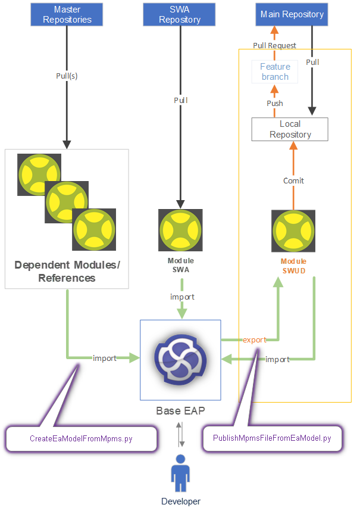
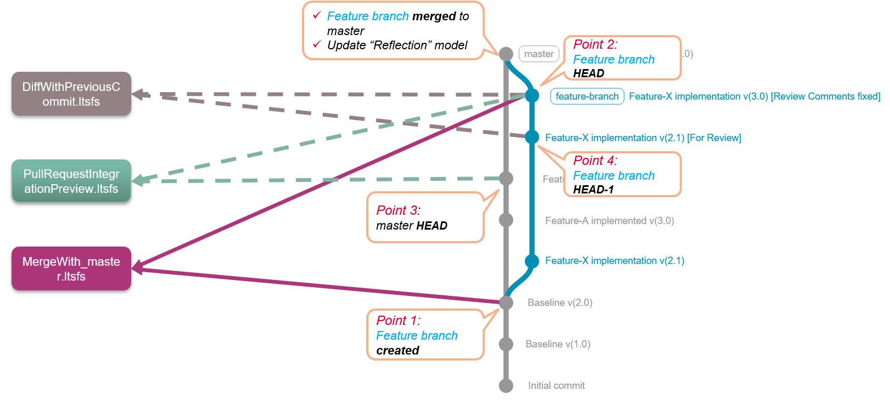

# Model Package Management System (MPMS) Scripts

Model Package Management System (MPMS) is a distributed modelling methodology, where each component is modelled as an independent file.

## MPMS Workflow



- To work on a component, the MPMS file first needs to be imported using [CreateEaModelFromMpms.py](/CreateEaModelFromMpms.py).
_Note: The script imports the component and all its dependencies._

- To push the changes made in the model to mainline, the EA model needs to be published using [PublishMpmsFileFromEaModel.py](/PublishMpmsFileFromEaModel.py).

_Note: Configuration management of the MPMS file will be as per the project._

## MPMS Diff Reports



MPMS scripts supports generation of three types of diff-reports

- Diff report with previous commit using [DiffWithPreviousCommit.py](/DiffWithPreviousCommit.py)
- Predictive Merge-Diff report after branch is merged to mainline using [MergeWithBranch.py](/MergeWithBranch.py)
- Predictive Integration-Diff report after branch is merged to mainline using [DiffPullRequestIntegrationWithPrevious.py](/DiffPullRequestIntegrationWithPrevious).

## Commands

### 1. Command to import MPMS _(CreateEaModelFromMpms.py)_

- Local Environment

    ```python
    "C:\Conan\aurix_rc1_sw_mcal\python\3.11.4\python.exe" "C:\git-repos\aurix3g_sw_mcal_tc4xx_tools_and_scripts\EA\04_MpmsScripts\CreateEaModelFromMpms.py" --pathToMpmsFile="C:/git-repos/aurix3g_sw_mcal_tc4xx_dev/00_MCAL/Rma/Rma_Dev/00_Architecture"
    ```

- Jenkins Environment

    ```python
    "C:\Conan\aurix_rc1_sw_mcal\python\3.11.4\python.exe" "C:\\git-repos\\aurix3g_sw_mcal_tc4xx_tools_and_scripts\\EA\\04_MpmsScripts\\CreateEaModelFromMpms.py " + "--pathToMpmsFile=" + env.WORKSPACE + " --getFilesFromBitBucket --username=" + env.USERNAME + " --password=" + env.PASSWORD + " --branch=" + prTargetBranch + " --jenkins"
    ```

### 2. Command to publish MPMS _(PublishMpmsFileFromEaModel.py)_

- Local Environment

    ```python
    "C:\Conan\aurix_rc1_sw_mcal\python\3.11.4\python.exe" "C:\git-repos\aurix3g_sw_mcal_tc4xx_tools_and_scripts\EA\04_MpmsScripts\PublishMpmsFileFromEaModel.py" --pathToEaFile="C:/git-repos/aurix3g_sw_mcal_tc4xx_dev/00_MCAL/Rma/Rma_Dev/00_Architecture"
    ```

- Jenkins Environment

    ```python
    "C:\Conan\aurix_rc1_sw_mcal\python\3.11.4\python.exe" "C:\\git-repos\\aurix3g_sw_mcal_tc4xx_tools_and_scripts\\EA\\04_MpmsScripts\\PublishMpmsFileFromEaModel.py " + "--pathToEaFile=" + env.WORKSPACE
    ```

### 3. Command to build reflection Model _(BuildReflectionModel.py)_

- Local Environment

    ```python
    "C:\Conan\aurix_rc1_sw_mcal\python\3.11.4\python.exe" "C:\git-repos\aurix3g_sw_mcal_tc4xx_tools_and_scripts\EA\04_MpmsScripts\BuildReflectionModel.py" --reflectionModelFullPath="C:/temp/master_tc4xx_sw_mcal.eapx" --directory="C:/git-repos/aurix3g_sw_mcal_tc4xx_dev/00_MCAL/Rma/Rma_Dev/00_Architecture" --branch=master
    ```

- Jenkins

    ```python
    "C:\Conan\aurix_rc1_sw_mcal\python\3.11.4\python.exe" "C:\\git-repos\\aurix3g_sw_mcal_tc4xx_tools_and_scripts\\EA\\04_MpmsScripts\\BuildReflectionModel.py " + "--reflectionModelFullPath=" + localFileName + "--directory=" + env.WORKSPACE + "--branch=" + branch_name + " --username " + env.USERNAME + " --password " + env.PASSWORD + " --jenkins"
    ```
